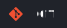
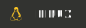

<h1 align="center">Hi , I'm Shailesh</h1>
<h3 align="center">I'm a passionate Front-end Developer from India.</h3>

 

## 🙋‍♂️ About Me

- 🌱 I’m currently learning **React, Redux & Redux Toolkit** 
- 👯 I’m looking to collaborate on **back-end developer for react front-end** 
- 👨‍💻 All of my projects are available at [shailesh.org](https://resume@shailesh.org) 
- 📫 How to reach me [contact@shailesh.org](mailto://contact@shailesh.org)
   
   

## 🌐 Socials:

 
 
 

# 💻 Tech Stack:

 
 

# 📊 GitHub Stats:

        

    
    
  

 
<!-- This shows Github Graph -->
<!--  -->

 
 
